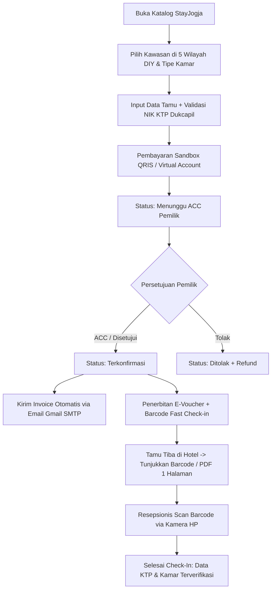
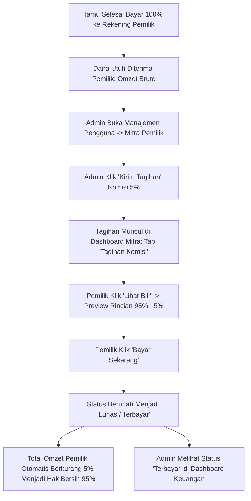

# Product Requirements Document (PRD)
## Aplikasi Reservasi Akomodasi Jogja ("StayJogja")

- **Versi:** 2.0 (Updated Baseline)
- **Tanggal:** 7 Oktober 2026
- **Status:** Approved / Production-Ready Prototype
- **Disusun untuk:** Skripsi — Pengembangan Prototipe Aplikasi Reservasi Akomodasi (Hotel, Homestay, Apartemen) dengan Fast Check-in QR Barcode, Sistem Bagi Hasil 95%:5%, Verifikasi Identitas NIK Dukcapil, dan Rekomendasi Cerdas di D.I. Yogyakarta

---

## 1. Latar Belakang

Aplikasi ini adalah platform reservasi akomodasi dengan alur terpadu mirip *Online Travel Agent* (OTA) populer seperti Traveloka atau Agoda, tetapi difokuskan secara eksklusif pada layanan akomodasi di wilayah Daerah Istimewa Yogyakarta (DIY) tanpa tiket transportasi.

Cakupan akomodasi dirancang inklusif untuk wilayah DIY:
1. **Hotel** (rentang bintang 1 hingga 5, serta hotel melati non-bintang)
2. **Homestay** (guest house / rumah sewa harian ramah keluarga)
3. **Apartemen** (unit sewa harian/mingguan)

### Nilai Tambah & Diferensiasi Utama
- **Fast Check-in Resepsionis via Barcode QR Cloud:** Resepsionis cukup memindai (*scan*) barcode dari e-voucher tamu menggunakan kamera HP untuk memuat data reservasi & identitas tamu secara instan tanpa formulir kertas manual.
- **Skema Bagi Hasil Transparan (95% Pemilik : 5% Platform):** Tamu membayar 100% langsung ke mitra pemilik; Admin kemudian menagihkan komisi platform sebesar 5% melalui invoice penagihan resmi, dan pemilik melunasinya secara mandiri di dashboard mereka.
- **Validasi Identitas NIK Dukcapil Otomatis:** Sistem mendeteksi dan memvalidasi NIK KTP tamu secara otomatis (wilayah, tanggal lahir, jenis kelamin).
- **Notifikasi Email Invoice Resmi Otomatis (Gmail SMTP):** Invoice resmi dikirimkan langsung ke email tamu segera setelah pesanan disetujui (ACC) oleh pemilik.
- **Ekspor Dokumen E-Voucher Presisi 1 Halaman (A4):** Format cetak PDF yang diisolasi ketat agar pas 1 halaman penuh tanpa halaman kosong berlebih.
- **Chatbot Rekomendasi Cerdas Berbasis AI (Gemini):** Memberikan rekomendasi wisata lokal, kuliner khas, dan estimasi budget di sekitar kawasan akomodasi yang dipilih.

---

## 2. Tujuan Produk

1. **Bagi Wisatawan (Tamu):**
   - Mempermudah pencarian dan pemesanan akomodasi di seluruh 5 kabupaten/kota DIY secara akurat.
   - Mempercepat proses registrasi saat tiba di hotel dengan barcode check-in.
   - Menerima bukti pembayaran dan e-voucher sah melalui aplikasi dan email.
2. **Bagi Pemilik Akomodasi (Mitra Pemilik):**
   - Mengelola pendaftaran unit, persetujuan reservasi (ACC / Tolak), dan memantau pendapatan bersih.
   - Membayar tagihan komisi platform 5% secara transparan melalui sistem invoice digital.
3. **Bagi Administrator:**
   - Mengawasi ekosistem melalui pemisahan data pengguna (Admin, Pemilik, Tamu).
   - Menagih dan memantau status komisi platform serta memoderasi properti dan transaksi global.

---

## 3. Ruang Lingkup (Scope)

### 3.1 Termasuk dalam Scope (In-Scope)
- **Pencarian Komprehensif Wilayah DIY:** Cakupan 5 daerah (Kota Yogyakarta, Sleman, Bantul, Kulon Progo, Gunungkidul).
- **Alur Reservasi Lengkap:** Pemesanan kamar → Pembayaran (Sandbox QRIS/VA) → ACC oleh Pemilik → Pengiriman Invoice ke Email → Terbit Barcode Check-in.
- **Portal Fast Check-In Resepsionis:** Scan QR barcode berbasis URL Cloud publik (kompatibel jaringan 4G/5G/Wi-Fi).
- **Manajemen Finansial & Skema Komisi 5%:** Billing tagihan komisi dari Admin ke Pemilik dan kalkulasi omzet bersih (95%).
- **Manajemen Profil Pengguna Global:** Pembaruan profil (Nama, Email, Telepon, Alamat) untuk seluruh role.
- **AI Chatbot Wisata & Kuliner:** Integrasi Google Gemini AI dengan guardrail khusus Daerah Istimewa Yogyakarta.
- **Cloud Architecture & Deployment:** Terhubung ke Supabase Cloud (PostgreSQL & Storage) dan siap di-deploy ke Vercel Serverless.

### 3.2 Di Luar Scope (Out-of-Scope)
- Tiket transportasi (pesawat, kereta api, bus antar-kota).
- Akomodasi di luar provinsi D.I. Yogyakarta.
- Transaksi perbankan riil non-sandbox.

---

## 4. Definisi Role & Aktor

| Role | Deskripsi | Hak Akses Utama |
| :--- | :--- | :--- |
| **User (Tamu / Wisatawan)** | Pengguna yang mencari, memesan, membayar akomodasi, dan melakukan check-in via barcode. | Pencarian katalog, filter kawasan DIY, booking unit, pembayaran sandbox, cetak PDF voucher 1 lembar, terima email invoice, edit profil, interaksi chatbot AI. |
| **Mitra Pemilik (Owner)** | Pemilik atau pengelola operasional hotel, homestay, atau apartemen. | Registrasi properti & tipe unit, persetujuan (ACC)/penolakan reservasi masuk, melihat tagihan komisi 5%, bayar komisi platform, monitoring omzet bersih, edit profil. |
| **Admin** | Pengelola sistem dan verifikator platform StayJogja. | Moderasi akun terpisah (Admin, Pemilik, Tamu), kirim tagihan komisi ke pemilik, monitoring status settlement komisi, audit reservasi global, moderasi properti, edit profil. |
| **Resepsionis (Frontdesk Staff)** | Petugas hotel yang memverifikasi kedatangan tamu. | Pindai barcode QR tamu dari kamera smartphone untuk memvalidasi KTP & menyelesaikan status check-in. |

---

## 5. User Flow Utama

### 5.1 Flow Pemesanan Tamu & Fast Check-In


### 5.2 Flow Skema Bagi Hasil & Pembayaran Komisi 5%


---

## 6. Functional Requirements (FR)

### 6.1 Modul Pencarian & Filter Kawasan Lengkap DIY
- **FR-1:** Pemilihan destinasi/kawasan dikelompokkan secara terstruktur mencakup seluruh wilayah DIY:
  - **Kota Yogyakarta:** Malioboro, Prawirotaman, Kotabaru, Kotagede, Keraton, Alun-Alun Kidul, dll.
  - **Kabupaten Sleman:** Depok, Seturan, Babarsari, Kaliurang, Gejayan, Prambanan, dll.
  - **Kabupaten Bantul:** Parangtritis, Dlingo, Mangunan, Kasongan, Imogiri, dll.
  - **Kabupaten Kulon Progo:** YIA, Glagah, Wates, Kalibawang, dll.
  - **Kabupaten Gunungkidul:** Wonosari, Baron, Indrayanti, Drini, Timang, dll.
- **FR-2:** Filter berdasarkan tipe akomodasi (Semua, Hotel, Homestay, Apartemen), rentang harga, klasifikasi bintang, dan fasilitas.

### 6.2 Modul Identitas & Validasi NIK Dukcapil
- **FR-3:** Penguraian NIK otomatis (*instant parser*): mendeteksi provinsi, kabupaten, kecamatan, tanggal lahir, dan jenis kelamin saat tamu menginput NIK.
- **FR-4:** Penyematan data KTP terverifikasi ke dalam e-voucher dan portal resepsionis.

### 6.3 Modul E-Voucher, Barcode QR & Cetak PDF 1 Halaman
- **FR-5:** Pembuatan QR Code dinamis berbasis URL Cloud publik (`https://.../checkin/:code`) yang dapat di-scan dari kamera HP mana pun (koneksi 4G/5G/Wi-Fi).
- **FR-6:** Modal cetak PDF yang diisolasi dengan `@media print` (`display: none !important` pada elemen latar) sehingga menghasilkan **tepat 1 halaman A4** bersih tanpa halaman kosong.

### 6.4 Modul Pengiriman Email Otomatis
- **FR-7:** Pengiriman email konfirmasi dan invoice otomatis ke alamat email tamu menggunakan integrasi Gmail SMTP (`nodemailer`) segera setelah pesanan di-ACC.

### 6.5 Modul Finansial & Tagihan Komisi 5%
- **FR-8:** Perhitungan otomatis nilai transaksi: Gross (100%), Komisi Platform (5%), dan Hak Bersih Pemilik (95%).
- **FR-9:** Fitur penagihan komisi dari Admin ke Pemilik pada Manajemen Pengguna.
- **FR-10:** Modal pratinjau tagihan (*Lihat Bill*) di dashboard pemilik dengan rincian biaya resmi sebelum pembayaran.
- **FR-11:** Penyesuaian nilai KPI Total Omzet pemilik yang otomatis berkurang menjadi hak bersih 95% setelah status komisi lunas.

### 6.6 Modul Manajemen Pengguna & Edit Profil Global
- **FR-12:** Pemisahan tabel akun di dashboard Admin menjadi 3 tabel terpisah: **Administrator**, **Mitra Pemilik**, dan **Tamu / Wisatawan**.
- **FR-13:** Fitur Edit Profil global untuk Tamu, Pemilik, dan Admin untuk memperbarui nama, email, nomor HP, dan alamat secara real-time.

### 6.7 Modul Chatbot Cerdas AI (Gemini)
- **FR-14:** Rekomendasi wisata dan kuliner lokal berbasis Google Gemini API dengan batasan topik seputar Yogyakarta.

---

## 7. Non-Functional Requirements (NFR)

| ID | Kategori | Spesifikasi Target |
| :--- | :--- | :--- |
| **NFR-1** | **Keamanan** | Enkripsi kata sandi menggunakan `bcrypt`. Pemisahan variabel sensitif via `.env` dan `.env.example`. |
| **NFR-2** | **Kompabilitas Deployment** | Arsitektur backend stateless Express.js yang siap di-deploy ke Vercel Serverless Functions via `vercel.json`. |
| **NFR-3** | **Aksesibilitas Barcode** | QR Code dapat dibaca oleh kamera smartphone standar dalam < 1 detik melalui koneksi internet seluler (4G/5G). |
| **NFR-4** | **Ketepatan Cetak** | Hasil cetak / save as PDF invoice reservasi wajib terkunci pada 1 halaman standar A4. |
| **NFR-5** | **Database Cloud** | Menggunakan Supabase PostgreSQL Cloud dengan skema relasional terpusat. |

---

## 8. Arsitektur Sistem & Cloud Stack

```
+-------------------------------------------------------------+
|             Frontend Client (HTML5 + Tailwind CSS + JS)     |
|   - Katalog & Filter Kawasan DIY   - E-Voucher A4 1-Page     |
|   - Dashboard Tamu / Pemilik       - Dashboard Admin         |
|   - Portal Check-In Resepsionis    - Widget AI Chatbot       |
+-------------------------------------------------------------+
                              │
                        HTTPS / JSON
                              ▼
+-------------------------------------------------------------+
|         Backend: Node.js + Express (Vercel Serverless)       |
|  ├── Auth & Profile Service       ├── NIK Dukcapil Parser   |
|  ├── Property & Booking Service   ├── QR Code Generator     |
|  ├── Finance & 5% Billing Service ├── Nodemailer SMTP       |
|  └── Gemini AI Chatbot Service                              |
+-------------------------------------------------------------+
        │                           │                    │
        ▼                           ▼                    ▼
+-------------------+      +-----------------+  +-----------------+
|   Supabase Cloud  |      |   Gmail SMTP    |  |  Google Gemini  |
|  (PostgreSQL DB)  |      | (Email Invoice) |  |   (AI Engine)   |
+-------------------+      +-----------------+  +-----------------+
```

---

## 9. Status Implementasi Fitur

| Fitur / Modul | Status | Keterangan |
| :--- | :---: | :--- |
| Katalog & Filter Seluruh Kawasan DIY | **Selesai (100%)** | 5 Kabupaten/Kota terakomodasi lengkap |
| Alur Booking & Pembayaran Sandbox | **Selesai (100%)** | QRIS & Virtual Account |
| Validasi NIK KTP Dukcapil | **Selesai (100%)** | Parsing otomatis wilayah, tgl lahir, gender |
| Barcode Fast Check-In Resepsionis | **Selesai (100%)** | URL Cloud Publik, scan via kamera HP |
| Pemisahan Tabel Pengguna Admin | **Selesai (100%)** | 3 Tabel terpisah: Admin, Owner, Tamu |
| Tagihan Komisi 5% & Omzet 95% | **Selesai (100%)** | Alur kirim bill, modal bill, & pelunasan |
| Cetak PDF Presisi 1 Halaman A4 | **Selesai (100%)** | Strict print isolation |
| Kirim Invoice via Gmail Otomatis | **Selesai (100%)** | Nodemailer SMTP terintegrasi |
| Edit Profil Global untuk Semua Role | **Selesai (100%)** | Modal & endpoint API sinkron |
| Desain Logo Baru Transparan (Tugu) | **Selesai (100%)** | File PNG transparan aktif di seluruh UI |
| Konfigurasi Deploy Vercel | **Selesai (100%)** | `vercel.json` & serverless handler aktif |

---

## 10. Dokumen Pengesahan

Dokumen PRD ini telah disesuaikan dan diperbarui mencerminkan seluruh implementasi nyata pada sistem aplikasi **StayJogja** per **7 Oktober 2026** sebagai acuan resmi pengujian dan penulisan laporan Skripsi.
