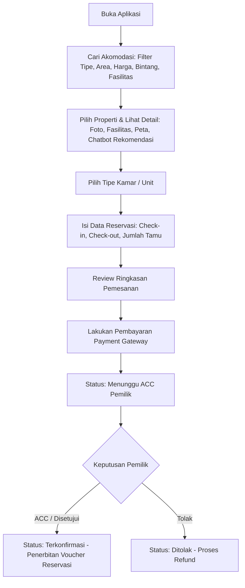
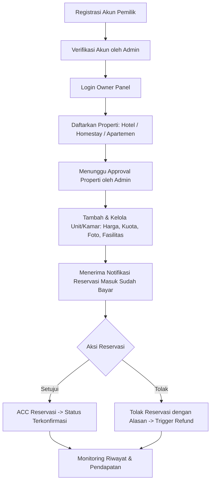
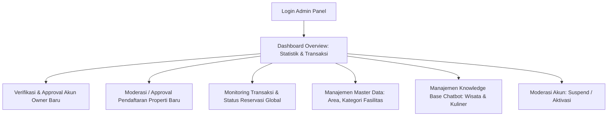
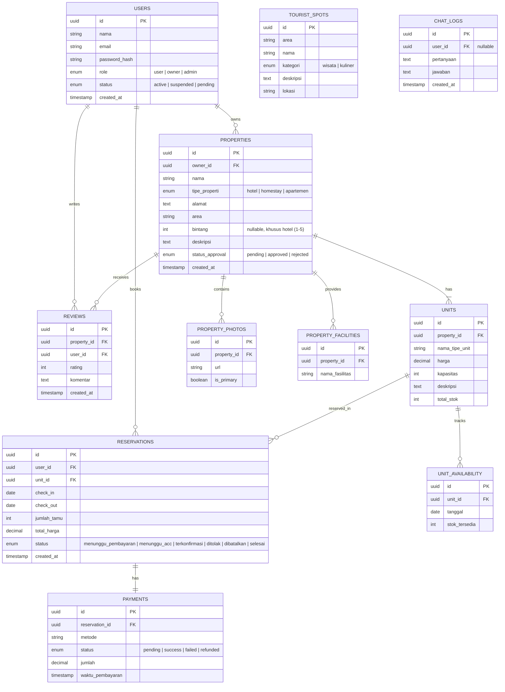
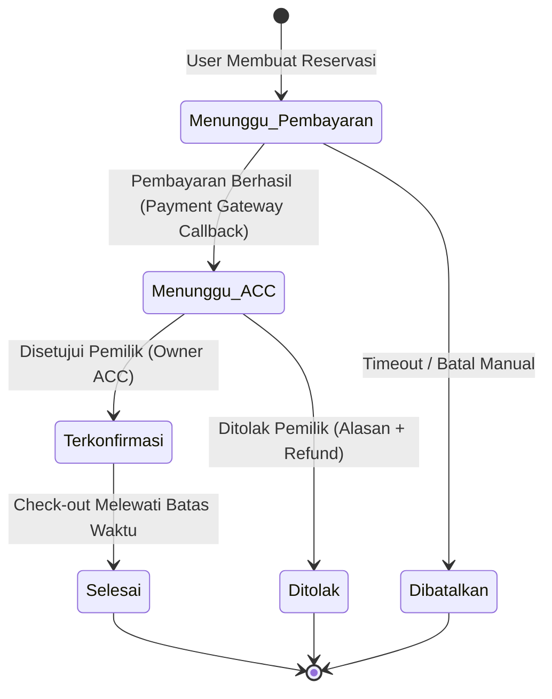

# Product Requirements Document (PRD)
## Aplikasi Reservasi Akomodasi Jogja ("StayJogja")

- **Versi:** 1.1
- **Tanggal:** 27 September 2026
- **Status:** Approved / Prototype Baseline
- **Disusun untuk:** Skripsi — Pengembangan Prototipe Aplikasi Reservasi Akomodasi (Hotel, Homestay, Apartemen) untuk Reservasi Kamar/Unit, Check-in, dan Check-out Tamu

---

## 1. Latar Belakang

Aplikasi ini adalah platform reservasi akomodasi dengan flow mirip *Online Travel Agent* (OTA) populer seperti Traveloka atau Agoda, tetapi difokuskan secara eksklusif pada layanan akomodasi tanpa tiket transportasi (pesawat, kereta, bus).

Cakupan akomodasi dirancang inklusif untuk wilayah Daerah Istimewa Yogyakarta (DIY), mencakup:
1. **Hotel** (rentang bintang 1 hingga 5, serta hotel melati non-bintang)
2. **Homestay** (guest house / rumah sewa harian)
3. **Apartemen** (unit sewa harian/mingguan)

### Nilai Tambah & Diferensiasi
- **Chatbot Rekomendasi Cerdas:** Membantu rekomendasi destinasi wisata, kuliner lokal, dan estimasi harga akomodasi berdasarkan budget secara kontekstual di sekitar akomodasi yang dipilih.
- **Pemberdayaan Akomodasi Menengah ke Bawah:** Menjembatani hotel melati, homestay keluarga, dan pemilik apartemen non-jaringan besar yang selama ini masih mengandalkan reservasi manual via chat/telepon dan belum terdaftar di platform OTA besar karena kendala komisi tinggi atau kompleksitas onboarding.

---

## 2. Tujuan Produk

1. **Bagi Wisatawan (Tamu):**
   - Mempermudah pencarian dan pemesanan kamar/unit akomodasi (hotel, homestay, apartemen) di Jogja berdasarkan preferensi spesifik (lokasi/area, rentang harga, tipe properti, klasifikasi bintang, dan fasilitas).
   - Membantu perencanaan itinerary dan estimasi budget melalui chatbot rekomendasi terintegrasi.
2. **Bagi Pemilik Akomodasi (Owner):**
   - Menyediakan sarana digital mandiri untuk mendaftarkan properti, mengatur ketersediaan & harga kamar/unit, serta mengelola konfirmasi reservasi (ACC) secara terstruktur.
3. **Bagi Administrator:**
   - Memberikan kontrol dan pengawasan penuh terhadap ekosistem (manajemen pengguna, verifikasi pemilik, moderasi properti, pemantauan transaksi, dan basis data chatbot).
4. **Bagi Industri Wisata Lokal:**
   - Mendigitalkan proses operasional akomodasi independen dan menengah ke bawah di Yogyakarta.

---

## 3. Ruang Lingkup (Scope)

### 3.1 Termasuk dalam Scope (In-Scope)
- Pencarian & pemesanan kamar/unit pada 3 tipe akomodasi: **Hotel**, **Homestay**, dan **Apartemen** di wilayah Yogyakarta.
- Alur lengkap reservasi: pemesanan, pembayaran (sandbox payment gateway), dan persetujuan (*approval* / ACC) oleh pemilik properti.
- Pendaftaran dan pengelolaan properti mandiri oleh pemilik properti.
- Panel administrasi untuk moderasi properti, verifikasi akun pemilik, dan audit transaksi.
- Chatbot berbasis AI dengan cakupan topik terbatas (*scoped domain*): rekomendasi wisata, kuliner, dan pencarian akomodasi sesuai budget di wilayah Yogyakarta.

### 3.2 Di Luar Scope (Out-of-Scope)
- Pemesanan tiket transportasi (pesawat, kereta api, bus, shuttle, dsb.).
- Akomodasi di luar wilayah Daerah Istimewa Yogyakarta.
- Transaksi multi-currency atau gateway pembayaran internasional riil.
- Chatbot percakapan umum di luar topik wisata, kuliner, dan akomodasi Jogja.

---

## 4. Definisi Role & Aktor

| Role | Deskripsi | Hak Akses Utama |
| :--- | :--- | :--- |
| **User (Tamu)** | Wisatawan yang mencari, memesan, dan membayar kamar/unit akomodasi di Jogja. | Pencarian, filter, booking, pembayaran, cek status voucher, interaksi chatbot, ulasan. |
| **Pemilik Akomodasi (Owner)** | Pemilik properti hotel, homestay, atau unit apartemen. | Pendaftaran properti, manajemen unit/kamar, monitoring pesanan masuk, persetujuan (ACC)/penolakan reservasi, laporan reservasi & pendapatan. |
| **Admin** | Pengelola sistem dan moderator platform. | Verifikasi akun owner, moderasi properti baru/edit, audit seluruh transaksi, manajemen user, pemeliharaan data wisata/kuliner chatbot. |

---

## 5. User Flow Utama

### 5.1 Flow Tamu (User)


### 5.2 Flow Pemilik Akomodasi (Owner)


### 5.3 Flow Administrator


---

## 6. Functional Requirements (FR)

### 6.1 Modul Autentikasi & Akun
- **FR-1:** Registrasi dan login dengan email & password untuk 3 role (User, Owner, Admin).
- **FR-2:** Verifikasi email saat proses registrasi.
- **FR-3:** *Role-Based Access Control* (RBAC) ketat pada API endpoint dan antarmuka web.
- **FR-4:** Fitur reset password melalui email / token terverifikasi.

### 6.2 Modul Pencarian & Katalog Akomodasi (User)
- **FR-5:** Pencarian akomodasi berdasarkan area/lokasi di wilayah Yogyakarta (Malioboro, Sleman, Bantul, Prawirotaman, dll.).
- **FR-6:** Filter katalog terperinci:
  - Tipe properti: Hotel, Homestay, Apartemen.
  - Klasifikasi bintang (1–5, khusus tipe hotel).
  - Rentang harga per malam.
  - Fasilitas (WiFi, Kolam Renang, Parkir, AC, Dapur, dll.).
- **FR-7:** Pengurutan (*sorting*): harga terendah, harga tertinggi, serta rating ulasan.
- **FR-8:** Halaman detail properti komprehensif: galeri foto, tipe akomodasi, deskripsi lengkap, daftar fasilitas, titik lokasi peta, daftar ulasan tamu, dan widget chatbot area sekitar.
- **FR-9:** Halaman detail tipe kamar/unit: spesifikasi kasur/kapasitas, harga per malam, fasilitas spesifik kamar, ketersediaan stok, dan foto unit.

### 6.3 Modul Reservasi & Pembayaran (User)
- **FR-10:** Pemilihan tanggal *check-in* & *check-out* serta kuantitas tamu dengan validasi ketersediaan unit secara dinamis.
- **FR-11:** Ringkasan rincian biaya sebelum konfirmasi: breakdown harga kamar per malam, total durasi, total tagihan, dan kebijakan pembatalan.
- **FR-12:** Integrasi sistem pembayaran payment gateway (simulasi/sandbox Midtrans / Xendit).
- **FR-13:** Manajemen status pesanan bertahap: *Menunggu Pembayaran*, *Menunggu ACC*, *Terkonfirmasi*, *Ditolak*, *Dibatalkan*, dan *Selesai*.
- **FR-14:** Halaman riwayat pemesanan user (daftar pesanan aktif dan lampau beserta e-voucher).
- **FR-15:** Notifikasi perubahan status pesanan (*in-app notification* dan/atau email).

### 6.4 Modul Manajemen Properti (Pemilik Akomodasi)
- **FR-16:** Formulir pendaftaran properti baru dengan penentuan tipe (Hotel / Homestay / Apartemen) yang memerlukan verifikasi Admin sebelum terbit.
- **FR-17:** Pengelolaan data properti (CRUD profil properti, foto galeri, fasilitas, dan rating bintang untuk hotel).
- **FR-18:** Pengelolaan tipe unit/kamar (CRUD nama kamar, kapasitas, harga sewa, kuota stok harian, foto, dan fasilitas unit).
- **FR-19:** Dashboard antrean reservasi masuk dengan tindakan: **ACC (Setujui)** atau **Tolak** (disertai keterangan alasan penolakan).
- **FR-20:** Laporan rekapitulasi reservasi dan estimasi pendapatan kotor/bersih per periode.

### 6.5 Modul Administrator
- **FR-21:** Peninjauan dan persetujuan pendaftaran akun Pemilik Akomodasi baru.
- **FR-22:** Moderasi dan kurasi pendaftaran properti baru (Hotel, Homestay, Apartemen) serta pengajuan perubahan data.
- **FR-23:** Pengelolaan Master Data sistem (daftar area/kawasan di Jogja, daftar master fasilitas properti & kamar).
- **FR-24:** Pemantauan menyeluruh seluruh transaksi dan audit log status reservasi lintas properti.
- **FR-25:** Manajemen akun pengguna (suspend, aktivasi, reset akun bermasalah).
- **FR-26:** Manajemen basis pengetahuan chatbot (*Knowledge Base Management*): pengelolaan data tempat wisata, kuliner, dan titik menarik per kawasan di Jogja.

### 6.6 Modul Chatbot Rekomendasi
- **FR-27:** Menjawab pertanyaan seputar tempat wisata dan kuliner lokal di area properti yang sedang dilihat tamu secara kontekstual.
- **FR-28:** Memberikan rekomendasi akomodasi (hotel/homestay/apartemen) berdasarkan budget yang diinputkan pengguna dengan merujuk data aktual sistem.
- **FR-29:** *Scoped Guardrail Topic*: Membatasi percakapan strictly pada domain pariwisata, kuliner, dan akomodasi di Yogyakarta. Permintaan di luar topik akan ditolak secara ramah dengan pesan default.
- **FR-30:** Riwayat interaksi sesi percakapan chatbot selama sesi aktif berjalan.

---

## 7. Non-Functional Requirements (NFR)

| ID | Kategori | Spesifikasi Target |
| :--- | :--- | :--- |
| **NFR-1** | **Keamanan** | - Enkripsi password menggunakan `bcrypt` dengan cost factor memadai.<br>- Proteksi SQL Injection (parameterized query / Supabase SDK), proteksi XSS, dan CSRF.<br>- Komunikasi seluruh endpoint wajib menggunakan HTTPS / TLS. |
| **NFR-2** | **Skalabilitas** | Backend stateless berbasis Express.js yang kompatibel dideploy sebagai Vercel Serverless Functions. |
| **NFR-3** | **Performa** | Waktu respon pencarian dan katalog akomodasi < 2 detik pada kondisi koneksi normal. |
| **NFR-4** | **Ketersediaan** | Mengandalkan arsitektur cloud serverless Vercel & database Supabase dengan target availability ≥ 99%. |
| **NFR-5** | **Usability** | Desain antarmuka berprinsip *mobile-first responsive design*, mudah diakses dari smartphone maupun desktop browser. |
| **NFR-6** | **Auditability** | Pencatatan log komprehensif untuk setiap perubahan status reservasi (aktor, timestamp, status awal, status akhir). |
| **NFR-7** | **Data Skripsi** | Dataset prototipe memuat 20–50 properti representatif di area DIY yang mencakup hotel, homestay, dan apartemen beserta data unit dan fasilitasnya. |

---

## 8. Arsitektur Sistem

```
+-------------------------------------------------------------+
|             Frontend (HTML5 + CSS3 + Vanilla JS)            |
|       - Mobile-First UI          - Chatbot Widget           |
|       - User/Owner/Admin View    - Fetch / REST API Client  |
+-------------------------------------------------------------+
                              │
                        HTTPS / JSON
                              ▼
+-------------------------------------------------------------+
|          Backend: Node.js + Express.js (Serverless)         |
|  ├── Auth & RBAC Service (JWT Authentication)               |
|  ├── Property & Unit Catalog Service                        |
|  ├── Reservation & Booking State Machine                    |
|  ├── Payment Gateway Webhook Service (Midtrans/Xendit)      |
|  ├── Admin & Moderation Service                             |
|  └── Scoped Chatbot Service (RAG + LLM Integration)         |
+-------------------------------------------------------------+
               │                               │
               │ (SDK / PgBouncer Pool)        │ (Context Data + Prompt)
               ▼                               ▼
+-----------------------------+ +-----------------------------+
|      Database & Storage     | |         LLM Provider        |
|    Supabase (PostgreSQL)    | | (OpenAI / Claude / Gemini)  |
| - Relational Data Tables    | | - System Prompt Guardrails  |
| - Connection Pooler         | | - Recommendations Output    |
| - Supabase Storage (Photos) | |                             |
+-----------------------------+ +-----------------------------+
```

### Catatan Teknis Arsitektur:
1. **Serverless Connection Pooling:** Karena backend Express.js di-deploy ke Vercel Serverless Functions, hindari *long-lived stateful database connections*. Gunakan Supabase Client SDK atau PgBouncer connection pooler port (6543) untuk mencegah kehabisan connection pool PostgreSQL.
2. **Implementasi Chatbot (Lightweight RAG):** Layanan backend mengekstrak data relevan (daftar akomodasi sesuai kriteria budget / tempat wisata terdekat dari tabel database), kemudian menyisipkannya ke dalam *system prompt* LLM sebagai *grounded context*.

---

## 9. Rancangan Data Model



---

## 10. Status Reservasi (State Machine)



### Penjelasan Transisi Status:
1. **Menunggu Pembayaran:** Pesanan baru tercatat, menunggu penyelesaian pembayaran dari tamu via payment gateway sebelum batas waktu pembayaran.
2. **Menunggu ACC:** Pembayaran telah terkonfirmasi sukses oleh gateway, pesanan masuk ke dashboard pemilik properti untuk disetujui ketersediaannya.
3. **Terkonfirmasi:** Pemilik properti menekan tombol ACC; sistem menerbitkan voucher reservasi resmi bagi tamu.
4. **Ditolak:** Pemilik berhalangan menyetujui ketersediaan; sistem mengarahkan ke proses refund dan memberikan notifikasi ke tamu.
5. **Dibatalkan:** Waktu pembayaran kadaluarsa atau dibatalkan oleh tamu sebelum pembayaran dilakukan.
6. **Selesai:** Tamu telah menyelesaikan masa inap (melewati tanggal check-out).

---

## 11. Prioritas Fitur (MVP vs Next Phase)

### 11.1 Minimum Viable Product (MVP) — Baseline Skripsi
- [x] Autentikasi dan otorisasi 3 role (User, Owner, Admin) berbasis JWT.
- [x] Manajemen properti & unit oleh Owner (Hotel, Homestay, Apartemen).
- [x] Moderasi dan approval properti oleh Admin.
- [x] Pencarian katalog, filter lokasi/area Jogja, tipe properti, harga, dan fasilitas.
- [x] Flow reservasi lengkap: Booking → Pembayaran Sandbox → ACC Owner → Status Terkonfirmasi.
- [x] Chatbot rekomendasi wisata/kuliner lokal dan rekomendasi harga akomodasi sesuai budget dengan guardrail topik Yogyakarta.

### 11.2 Next Phase (Pengembangan Lanjutan Pasca-MVP)
- [ ] Sistem ulasan dan rating terverifikasi pasca-checkout.
- [ ] Pengiriman notifikasi otomatis via email (SendGrid/Resend) atau WhatsApp Gateway.
- [ ] Dashboard analitik pendapatan dan okupansi tingkat lanjut bagi Admin & Owner.
- [ ] Penyimpanan riwayat chat persisten di database pengguna.

---

## 12. Metrik Keberhasilan (Kriteria Pengujian Skripsi)

1. **Uji Fungsionalitas End-to-End:** Berhasil menjalankan skenario lengkap tanpa kegagalan:
   $$\text{Cari Akomodasi} \longrightarrow \text{Pesan Unit} \longrightarrow \text{Bayar (Sandbox)} \longrightarrow \text{ACC Owner} \longrightarrow \text{Terkonfirmasi}$$
2. **Akurasi Chatbot:**
   - Mampu memberikan saran kuliner dan wisata relevan di kawasan akomodasi terkait.
   - Mampu mengelompokkan rekomendasi unit akomodasi yang sesuai dengan batasan budget pengguna.
3. **Keandalan Guardrail AI:** Chatbot secara konsisten menolak pertanyaan di luar topik Jogja (misal matematika, coding umum, politik) dengan jawaban sopan terstandar.
4. **Validasi Multi-Tipe:** Admin dan Owner dapat mengelola ketiga tipe properti (Hotel, Homestay, Apartemen) dengan validasi data yang sesuai (khususnya opsionalitas bintang untuk non-hotel).

---

## 13. Risiko & Mitigasi

| Risiko | Dampak | Strategi Mitigasi |
| :--- | :--- | :--- |
| **Koneksi Database Habis di Serverless** | Server error 500 saat traffic meningkat pada Vercel Functions. | Menggunakan Supabase JS SDK (HTTPS REST) atau mengaktifkan PgBouncer connection pooling bawaan Supabase. |
| **Hallucination pada Chatbot LLM** | Chatbot memberikan info rekomendasi yang tidak akurat atau di luar Jogja. | Menetapkan *system prompt* ketat, parameter temperature rendah ($\le 0.4$), serta menyuntikkan data internal (*grounded context*) akomodasi & wisata Jogja. |
| **Kompleksitas Perbedaan Tipe Akomodasi** | Apartemen biasanya sistem bulanan/mingguan, hotel sistem harian. | Menyeragamkan unit terkecil pemesanan pada prototipe MVP ke basis **per malam** untuk semua tipe properti. |
| **Ketergantungan Payment Gateway** | Gangguan integrasi transaksi pihak ketiga saat demonstrasi. | Menggunakan mode Sandbox Midtrans/Xendit serta menyediakan endpoint mock payment untuk skenario demo darurat offline. |
| **Spaghetti Code pada Vanilla JS** | Kesulitan perbaikan bug antarmuka di sisi frontend. | Menerapkan struktur kode modular: memisahkan logic per modul (API service, view rendering, state handling, modal utils). |
